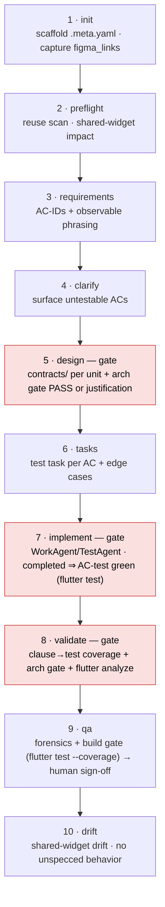

# flutter-specflow — a self-contained, spec-driven workflow for Flutter/Dart

`flutter-specflow` is a drop-in spec-driven development workflow for a **Flutter** project, modeled on
the React `oac-specflow` bundle. A spec marked "Completed" provably means *the stated behavior is
verified in an independently testable unit*: it binds every acceptance criterion to a named,
outcome-asserting Dart test **at authoring time** and gates the architecture (the verifiable-unit
question, P8) **at phase exit**.

It is built around a **four-layer architecture** and is **deliberately state-management-package
agnostic** — the universal principles ship here; your package's idioms (Riverpod / Bloc / Provider /
signals…) live in a dedicated **package skill** (e.g. `fl-riverpod`), loaded when that package is detected.

It is **self-contained**: every command, skill, and rule references only files bundled inside this
folder, by **relative path**. The one optional outward dependency is the installed `scan-resource`
skill, used only on the feature driver's legacy-port path.

## The four-layer architecture

Dependencies point one way only — **UI → Provider → Data → Service** — and raw data flows up through a
processing pipeline into immutable business models:

```
UI Layer        widgets: watch shared state, hold ephemeral private state, run methods, build sub-trees
   │ depends on                                                              ▲ build(state)
Provider Layer  state holders: expose observable state + commands  (state-management-package AGNOSTIC)
   │ depends on                                                              ▲ notify / watch
Data Layer      repositories: single source of truth; raw DTO → immutable domain model
   │ depends on                                                              ▲ processed business models
Service Layer   data sources: REST ApiClient and other raw sources; raw payloads, no business logic
```

The bundled architecture principles (P1–P8) and the `fl-architecture-design` rule corpus are authored directly against this model.

## General by design; project-specific at the seams

The **skills and rules are general Flutter/Dart best practice** — distilled from the official Flutter
*App Architecture* guide, *Performance best practices*, and widely-adopted community sources. The
**project-specific layer** is the state-management package skill. The agnostic core covers state
ownership, SSOT, sealed async, and disposal; the package-specific idioms (e.g. Riverpod's
`ref.watch`/`read`/`listen`, provider lifetime, `AsyncNotifier`, `.select`, testing) live in the
**`fl-riverpod`** skill, loaded when the project uses Riverpod. For another package, write an
analogous `fl-bloc` / `fl-provider` skill.

## How this maps to the `.claude/` directory

Follows the official Claude Code directory model — see <https://code.claude.com/docs/en/claude-directory>.

| Layer | `.claude/` home | What it is |
|---|---|---|
| **commands** | `commands/` | One thin `/fl-spec-<stage>` command per lifecycle stage — its process, gate/exit criteria, and which skill/rule it delegates to. The project-specific process layer. |
| **skills** | `skills/` | Self-contained problem-solvers, each carrying its own `references/` (where the worked Dart examples live). |
| **rules** | `rules/` | Short, path-gated topic files of always-on discipline (`paths: **/*.dart`), no long code listings. |
| **agents** | `agents/` | One orchestrator per workflow (`fl-{feature,brownfield,bugfix,quickfix}-workflow`) — drives the phases in order and enforces the gates. |

```
agents/     ── orchestration: drive a spec through the lifecycle, enforce gates
   │ delegates to
commands/   ── PROCESS (project-specific): one thin /fl-spec-* per stage; gate/exit criteria + delegations
   │ delegates to
skills/     ── GENERAL: self-contained problem-solvers (each with its own references/ + Dart examples)
rules/      ── GENERAL & ALWAYS-ON: short, path-gated topic files applied on every relevant turn
```

## Directory layout

```
flutter-specflow/
├── README.md                          ← this file
├── agents/
│   ├── fl-feature-workflow.md         ← full feature lifecycle; optional legacy/cross-stack port via scan-resource
│   ├── fl-brownfield-workflow.md      ← in-place change to an existing feature (mandatory impact analysis)
│   ├── fl-bugfix-workflow.md          ← root-cause + failing reproduction test → smallest fix to green
│   └── fl-quickfix-workflow.md        ← minimal change + ≥1 AC-traceable test; escalates if it grows
├── commands/                          ← thin, process, one per stage
│   ├── fl-spec-init.md  fl-spec-preflight.md  fl-spec-requirements.md  fl-spec-clarify.md
│   ├── fl-spec-design.md  fl-spec-tasks.md  fl-spec-implement.md  fl-spec-validate.md
│   └── fl-spec-qa.md  fl-spec-drift.md  fl-spec-status.md  fl-spec-steer.md
├── rules/                             ← short, path-gated (paths: **/*.dart), general, no code listings
│   ├── engineering-discipline.md      ← simplicity / surgical / read-first / convention / goal / budget
│   ├── architecture-principles.md     ← P1–P8 the code is authored against (the four-layer model)
│   ├── test-quality.md                ← the Dart/Flutter test-quality contract
│   └── preferences.md                 ← verbatim delegation preferences
└── skills/                            ← concrete, self-contained, each with references/ (+ Dart examples)
    ├── fl-architecture-design/        ← design-time skill; OWNS the rule corpus + the design procedure
    │   └── references/ — core/ (13 universal rules, each with a concise sample) + conditional/performance/ (6 rules) +
    │         how-to-use index + principle examples/checks + design-procedure
    ├── fl-architecture-gate/          ← lightweight verifier (P8 + 3 triggers + report formats); references the corpus
    ├── fl-acceptance-criteria/        ← stable AC IDs + observable Given/When/Then → group()/test()/testWidgets() names
    ├── fl-test-contract/              ← the 6-rule Dart/Flutter test contract, with worked right/wrong examples
    ├── fl-test-forensics/             ← gap-class + false-positive/over-mock detection (QA/drift)
    ├── fl-pr-review/                  ← review a PR / branch / diff against the rule corpus; optional GitHub post
    └── fl-riverpod/                  ← Riverpod-specific idioms; load when the project uses Riverpod
```

## The lifecycle



> Always-on across every relevant turn: **architecture-principles** (P1–P8 — authored against at
> requirements, design, implement), **test-quality** (every `*_test.dart` edit), **engineering-discipline**
> (every code-writing turn). `fl-spec-status` / `fl-spec-steer` run any time.

## Workflows — pick the driver that matches your change

| Driver agent | Phases | Use when |
|---|---|---|
| `fl-feature-workflow` | init → preflight → requirements → clarify → design → tasks → implement → validate → qa → drift | New feature, greenfield **or a legacy/cross-stack port** (it scans the legacy source with `scan-resource` to seed requirements/design) |
| `fl-brownfield-workflow` | init → preflight (impact analysis · mandatory) → requirements → design → tasks → implement → validate → qa → drift | Modifying an existing Flutter feature in place; impact analysis is the safety gate (no clarify) |
| `fl-bugfix-workflow` | init → analysis (failing reproduction test) → tasks → implement → validate → qa (opt) → drift | Fixing a defect; reproduction-test-first |
| `fl-quickfix-workflow` | init → describe (one AC) → implement → validate → qa (opt) | A small, self-contained change; still ≥1 AC-traceable test; escalates to feature/bugfix if it grows |

## Command → delegation map

Skills (`../skills/…`) carry the procedure; rules (`../rules/…`) are always-on. The build gate for this
stack is **`flutter analyze`** (zero new issues) + **`flutter test`** (`--coverage` at QA).

| Stage command | Skills | Rules | Blocking gate |
|---|---|---|---|
| `fl-spec-init` | — | engineering-discipline | — |
| `fl-spec-preflight` | — | — | reuse verdict + shared-widget impact table |
| `fl-spec-requirements` | fl-acceptance-criteria | — | every AC has a stable ID + observable phrasing |
| `fl-spec-clarify` | fl-acceptance-criteria | — | untestable ACs surfaced |
| `fl-spec-design` | fl-architecture-design (author), fl-architecture-gate (verify) | architecture-principles | **contracts/ per unit (widget/holder/repo/service/model); arch gate PASS or justification** |
| `fl-spec-tasks` | fl-test-contract, fl-acceptance-criteria | test-quality | a test task per AC + edge-case tasks |
| `fl-spec-implement` | fl-test-contract | architecture-principles, engineering-discipline, test-quality | **(WorkAgent, TestAgent) phases; "completed" ⇒ AC-traceable Dart test passes** |
| `fl-spec-validate` | fl-test-contract, fl-architecture-gate | test-quality | **clause→test coverage + arch gate + flutter analyze** |
| `fl-spec-qa` | fl-test-forensics, fl-test-contract | test-quality | `qa-report.md` — forensics + build gate → human sign-off |
| `fl-spec-drift` | fl-test-forensics | — | shared-widget drift + no unspecced behavior |
| `fl-spec-status` / `fl-spec-steer` | — | — | observability / steering |

## State management: a separate package skill

The workflow keeps the **core package-agnostic**: state ownership, one-owner/derive, sealed async,
and disposal live in `core/`. The **package-specific idioms live in the `fl-riverpod` skill** — ref
API by call site (`ref.watch`/`read`/`listen`), provider lifetime including `keepAlive`/`autoDispose`,
`AsyncNotifier`/`AsyncValue`, `.select` for narrow rebuilds, and provider testing. The agent loads
this skill when it detects Riverpod in the project (via `pubspec.yaml`, `@riverpod` annotations, or
`ref.watch` calls). For any other package, author an analogous skill covering the same idiom
categories.

## Skills (general Flutter best practice)

- **fl-architecture-design** — the **design-time** skill: it OWNS the rule corpus (**13 high-level
  `core/` rules** + the `conditional/performance/` pack + the rule index + worked P1–P8 examples) and
  a **design procedure** that applies them *while you author* `design.md` + `contracts/` — four-layer
  layering, the state-ownership tiers, SSOT, immutable+equatable domain models, and the per-unit
  testability seam. Invoked by `/fl-spec-design`.
- **fl-architecture-gate** — the **lightweight verifier** (P8): does each spec map onto a widget
  renderable via `pumpWidget` with injected fakes, or a holder/repository/service invocable in pure
  `dart test` with constructor-injected fakes, without mocking its host? Carries only the gate question,
  the three blocking triggers, and the PASS/FAIL/justification report formats; confirms against the
  `fl-architecture-design` corpus. Blocks on God-widget/God-holder, layer-violation/dual-source-of-truth,
  or a missing testability seam. Run at design exit and at validate.
- **fl-acceptance-criteria** — stable `AC-<story>.<n>` / `NFR-<n>` IDs and observable Given/When/Then
  phrasing that flow one-to-one into `group()` / `test()` / `testWidgets()` names, so coverage is a grep.
- **fl-test-contract** — the 6-rule Dart/Flutter test contract (observable outcomes not implementation;
  AC-ID in `group`; fixtures from the production domain type; fakes-over-mocks, no tautologies; real
  `StreamController`/`ProviderContainer` + `expectLater`/`fakeAsync` for async config; one-shot greps →
  CI guards).
- **fl-test-forensics** — detects the three gap classes (no-spec-coverage, tests-pass-but-miss-behavior,
  false-positive) with Flutter/Dart heuristics (over-mocking, `verify`-only, `pumpAndSettle`-with-network,
  internal-state assertions, stream tests without `emitsInOrder`).
- **fl-pr-review** — a standalone review tool (run any time, e.g. before opening a PR): applies the
  bundled rules to a PR / branch / working-tree diff — the verifiable-unit gate (P8) + the `core/`
  architecture rules, the `conditional/performance/` pack when relevant, and the `fl-riverpod` skill
  when the project uses Riverpod, plus the test-quality contract via `fl-test-contract` /
  `fl-test-forensics`. Reviews only changed code; produces a severity-classified, rule-cited review;
  optionally posts inline comments + a verdict to GitHub (opt-in, confirm-first, never auto-approve).
- **fl-riverpod** — Riverpod-specific guidance loaded when the project uses Riverpod (detected via
  pubspec / `@riverpod` / `ref.watch`): `ref.watch`/`read`/`listen` by call site, provider
  declaration & lifetime, `AsyncNotifier`/`AsyncValue`, `.select` for narrow rebuilds, and provider
  testing. Complements the agnostic core; for another package, write an analogous skill.

## Rules (general, always-on, path-gated to `**/*.dart`)

- **engineering-discipline** — smallest change, surgical diffs, read-before-write, convention,
  goal-driven, hard iteration budgets (reused verbatim — stack-agnostic).
- **architecture-principles** (P1–P8) — the four-layer design rules every spec is authored against.
  Worked right/wrong Dart examples live in `skills/fl-architecture-design/references/`.
- **test-quality** — the test contract (assert observable outcomes; map each test to an AC ID; fixtures
  from the production type; no tautologies, fakes-over-mocks; real async machinery; greps → CI guards).
- **preferences** — verbatim delegation preferences (reused).

## What's included vs. deferred

This is the **core flow** build. Included: a lean ~13-rule high-level `core/` plus the `conditional/performance` pack, seven skills (`fl-architecture-design`, `fl-architecture-gate`, `fl-acceptance-criteria`, `fl-test-contract`,
`fl-test-forensics`, `fl-pr-review`, `fl-riverpod`), all twelve `fl-spec-*` stage commands, and all four
drivers (`fl-feature-workflow`, `fl-brownfield-workflow`, `fl-bugfix-workflow`, `fl-quickfix-workflow`).

**Deferred** (can be added later, each mirroring its `oac-specflow` counterpart): a dedicated
`fl-qa-report` skill, an `fl-journey-tests` skill (integration_test/patrol E2E), and an
`fl-figma-decompose` skill (Figma → widget map). Until then,
`fl-spec-qa` runs forensics + the build gate, and `fl-spec-preflight` does the reuse/impact scan
without Figma decomposition.

## Provenance

The rules distill public best-practice sources, cited as links in each rule file (never required to
run): the official Flutter **App Architecture** guide and case studies, **Performance best practices**
and **Impeller/rendering** docs, Effective Dart / `flutter_lints` / DCM lint rules, and widely-adopted
community references (Code With Andrea, Very Good Ventures, ResoCoder, bloc/riverpod/provider docs).

## Conventions

- **Relative paths only.** A command references a skill as `../skills/<name>/SKILL.md` and a rule as
  `../rules/<name>.md`; a skill references a rule as `../../rules/<name>.md` and its own material as
  `references/<file>.md`; an agent references `../commands/<name>.md`. No absolute paths anywhere.
- **Prefix `fl-*`** on every command, skill, and agent to distinguish from the React `oac-*` flow.

## Install / use

Copy the four layers into the target Flutter project's `.claude/`:

```
cp -R flutter-specflow/commands/*   <project>/.claude/commands/
cp -R flutter-specflow/skills/fl-*  <project>/.claude/skills/
cp -R flutter-specflow/agents/*     <project>/.claude/agents/
cp -R flutter-specflow/rules/*      <project>/.claude/rules/
```

Then **load the `fl-riverpod` skill** when the project uses Riverpod (adapt it, or write an analogous
package skill), and drive a spec end-to-end with the matching driver (`fl-feature-workflow` / `fl-brownfield-workflow` / `fl-bugfix-workflow` / `fl-quickfix-workflow`) — or run
the stage commands in order (`fl-spec-init` → … → `fl-spec-drift`). Because skills and rules are
referenced by relative path *within the bundle*, keep the four directories together under one parent
when you copy them over.
