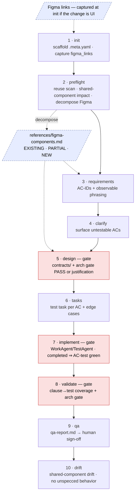

# oac-specflow — a self-contained, refined spec-driven workflow for React/TypeScript

`oac-specflow` is a drop-in spec-driven development workflow for a **React 19 + Vite + TypeScript +
Zustand + TanStack Query + MUI + Vitest** project. It refines a generic `spec-*` flow so that a spec
marked "Completed" provably means *the stated behavior is verified in an independently testable unit*:
it binds every acceptance criterion to a named, outcome-asserting test **at authoring time** and gates
the architecture (the verifiable-unit question) **at phase exit**.

It is **fully self-contained**: every command, skill, and rule references only files bundled inside
this folder, by **relative path**. Nothing depends on an external or installed skill being available
(in particular it never invokes `/react-architecture-review` — those rules are bundled here).

## General by design; project-specific at the seams

The **skills and rules are general React/TS best practices** — they apply unchanged to any project on
this stack. The **commands are the project-specific layer**: thin per-stage process wrappers you adapt
to your repo's conventions. The clearest example is
[`commands/_oac-jira-status-automation.md`](commands/_oac-jira-status-automation.md), the **per-project
adaptation point**: a worked issue-tracker playbook (wired here to a Jira workflow) that you rewrite
for your own tracker, or delete if you have none. Everything else ships as-is.
The other place project specifics live is *data the general skills read* — most visibly `oac-figma-decompose`'s `references/token-map.md` and the project's `.claude/figma-reference.md`, which you fill in per project; the skill's procedure stays general.

## How this maps to the `.claude/` directory

The layout follows the official Claude Code directory model — see
<https://code.claude.com/docs/en/claude-directory>. Each layer corresponds to a standard `.claude/`
subdirectory:

| Layer | `.claude/` home | What it is (per the official doc) |
|---|---|---|
| **commands** | `commands/` | A markdown file `commands/<name>.md` is invoked as `/<name>`. Here: one thin command per lifecycle stage — the stage's process, its gate/exit criteria, and which skill/rule it delegates to. |
| **skills** | `skills/` | Each skill is a folder with a `SKILL.md` plus any supporting files it needs; invoked as `/<name>` or auto-invoked by its `description`. Here: self-contained problem-solvers, each carrying its own `references/` (where the worked code examples live). |
| **rules** | `rules/` | "Topic-scoped instructions, optionally gated by file paths." A rule with `paths:` frontmatter loads only when a matching file enters context; without `paths:` it loads at session start. Here: short, path-gated topic files of always-on discipline — **no long code listings** (those live in skill `references/`). |
| **agents** | `agents/` | Each markdown file defines a subagent with its own context window, system prompt, and tool access. Here: the orchestrator that drives a spec through the lifecycle and enforces the gates. |

```
agents/     ── orchestration: drive a spec through the lifecycle, enforce gates
   │ delegates to
commands/   ── PROCESS (project-specific): one thin /command per stage; gate/exit criteria + delegations
   │ delegates to
skills/     ── GENERAL: self-contained problem-solvers (each with its own references/ + examples)
rules/      ── GENERAL & ALWAYS-ON: short, path-gated topic files applied on every relevant turn
```

> **Provenance / rationale.** The reasoning behind every refinement lives in the originating analysis
> workspace: the thesis `../thesis/the-refinement-of-specflow-for-react.md` and the synthesis
> `../final-report.md`. Those links are documentation only — the bundle does not need them to run.

## Directory layout

```
oac-specflow/
├── README.md                         ← this file
├── agents/
│   └── oac-spec-driver.md            ← orchestrator: runs the lifecycle, enforces gates
├── commands/                         ← thin, process, one per stage (the project-specific layer)
│   ├── oac-spec-init.md  oac-spec-preflight.md  oac-spec-requirements.md  oac-spec-clarify.md
│   ├── oac-spec-design.md  oac-spec-tasks.md  oac-spec-implement.md  oac-spec-validate.md
│   ├── oac-spec-qa.md  oac-spec-drift.md  oac-spec-status.md  oac-spec-steer.md
│   └── _oac-jira-status-automation.md   ← THE per-project adaptation point (issue-tracker playbook)
├── rules/                            ← short, path-gated topic files; general; no code listings
│   ├── engineering-discipline.md     ← simplicity/surgical/read-first/convention/goal/budget
│   ├── architecture-principles.md    ← P1–P7 the code is authored against (paths: **/*.ts,tsx)
│   ├── test-quality.md               ← the test-quality contract (paths: **/*.test.*, **/*.spec.*)
│   ├── principles.md                 ← verbatim engineering principles (bundled)
│   └── preferences.md                ← verbatim delegation preferences (bundled)
└── skills/                           ← concrete, self-contained, each with references/ (+ examples)
    ├── oac-acceptance-criteria/      ← stable AC IDs + observable Given/When/Then + traceability
    ├── oac-test-contract/            ← the test-quality contract, with worked examples for the rule
    ├── oac-architecture-gate/        ← the verifiable-unit gate; bundles the full review rule set
    │   └── references/rules-architecture/ (23) + rules-performance/ (22) + gate-procedure, principle-examples/checks
    ├── oac-qa-report/                ← QA audit → sign-off-ready report (build gate, authenticity, scope, coverage, silent-failure)
    ├── oac-journey-tests/            ← optional: E2E journey tests behind a human-approved plan
    ├── oac-test-forensics/           ← gap-class + false-positive/mock-shape detection (QA/drift)
    └── oac-figma-decompose/          ← decompose a Figma screen into a component map (EXISTING/PARTIAL/NEW) for preflight
```

## The lifecycle



> Always-on across every relevant turn: **architecture-principles** (P1–P7 — authored against at requirements, design, implement), **test-quality** (every `*.test.*` / `*.spec.*` edit), **engineering-discipline** (every code-writing turn). Dashed nodes are the optional Figma seam; `oac-spec-status` / `oac-spec-steer` run any time.

## Command → delegation map

Skills (`../skills/…`) carry the procedure; rules (`../rules/…`) are always-on.

| Stage command | Skills | Rules | Blocking gate |
|---|---|---|---|
| `oac-spec-init` | — | engineering-discipline | — |
| `oac-spec-preflight` | oac-figma-decompose (when a design exists) | — | reuse verdict + shared-component impact table |
| `oac-spec-requirements` | oac-acceptance-criteria | — | every AC has a stable ID + observable phrasing |
| `oac-spec-clarify` | oac-acceptance-criteria | — | untestable ACs surfaced |
| `oac-spec-design` | oac-architecture-gate | architecture-principles | **design.md + contracts/ drafted; arch gate PASS or justification** |
| `oac-spec-tasks` | oac-test-contract, oac-acceptance-criteria | test-quality | a test task per AC + edge-case tasks |
| `oac-spec-implement` | oac-test-contract | architecture-principles, engineering-discipline, test-quality | **(WorkAgent, TestAgent) phases; "completed" ⇒ AC-traceable test passes** |
| `oac-spec-validate` | oac-test-contract, oac-architecture-gate | test-quality | **clause→test coverage + arch gate** |
| `oac-spec-qa` | oac-qa-report, oac-test-forensics, oac-test-contract, oac-journey-tests (opt) | test-quality | `qa-report.md` — audits + forensics → human sign-off |
| `oac-spec-drift` | oac-test-forensics | — | shared-component drift + no unspecced behavior |
| `oac-spec-status` / `oac-spec-steer` | — | — | observability / steering |

> **`oac-spec-implement` merges two of the user's own enhancements** — the original `/implement` and the
> `(WorkAgent, TestAgent)` phased-execution model (formerly a separate `/spec-phase`). It plans the tasks
> into ordered phases of one-to-one `(WorkAgent, TestAgent)` groups and runs the per-group coordination
> loop (WorkAgent implements its surfaces → paired TestAgent writes the AC-traceable outcome tests →
> green). There is **no separate phase stage**; the phasing lives inside implement.

## Skills (general, concrete, self-contained)

These encode general best practices, with worked right/wrong code examples in each skill's `references/`.

- **oac-acceptance-criteria** — give every acceptance criterion a stable ID (`AC-<story>.<n>`) and an
  observable Given/When/Then phrasing, so coverage becomes a runnable query.
- **oac-test-contract** — the canonical test-quality contract (clause→test mapping; outcome-not-
  implementation; production-shaped fixtures via `satisfies`/MSW; no tautologies; real `QueryClient`
  for query-config NFRs; one-shot greps → CI guards). This is where the worked examples for the
  always-on `test-quality` rule live.
- **oac-architecture-gate** — the verifiable-unit gate. Runs the review by reading the **bundled**
  `react-architecture-review` / `react-performance-review` rules under its own `references/`; blocks on
  God-component/hook, server-state-in-Zustand, or a missing testability seam.
- **oac-test-forensics** — detects the three gap classes (no-spec-coverage, tests-pass-but-miss-
  behavior, false-positive) with React/TS heuristics, at QA and drift time.
- **oac-qa-report** — audits a handed-off branch (build gate, spec-authenticity, scope-creep,
  coverage/false-positive, silent-failure, consumer/regression) into one sign-off-ready
  `qa-report.md`; reuses oac-test-forensics + oac-test-contract for the test-quality dimension.
- **oac-journey-tests** — optional: author end-to-end journey tests for the user stories, behind a
  human-approved journey plan (the per-unit tests are written at implement).
- **oac-figma-decompose** — turn a Figma screen into a compact component map (EXISTING / PARTIAL / NEW vs. the codebase); Figma links are captured at `oac-spec-init` (`figma_links` in `.meta.yaml`), decomposed at `oac-spec-preflight` into `references/figma-components.md`, and consumed by requirements and design; extracts only genuinely new components via parallel agents.

## Rules (general, always-on, path-gated)

Rules are short topic files. They state the principle and cite an external best-practice link; the
**code examples live in the skill `references/`, not in the rule** — keeping rules small enough to load
on every relevant turn.

- **engineering-discipline** — how an agent moves while writing code (smallest change, surgical diffs,
  read-before-write, convention, goal-driven, hard iteration budgets). Bundles `principles.md` and
  `preferences.md` verbatim.
- **architecture-principles** (P1–P7) — the design rules every spec is authored against; `paths:`-gated
  to `**/*.ts(x)`. Worked right/wrong examples live in `skills/oac-architecture-gate/references/`.
- **test-quality** — the test-quality contract (assert observable outcomes not implementation; map each
  test to an AC ID; build fixtures from the production type; no tautologies; real `QueryClient` for
  query-config; turn one-shot greps into CI guards); `paths:`-gated to `**/*.test.*` / `**/*.spec.*`.
  How-to + examples: `skills/oac-test-contract/SKILL.md`.

## Self-containment & bundled-resource provenance

Everything is bundled and referenced by relative path. Resources copied in from outside (so the bundle
works even when the originals are absent):

| Bundled here | Original source | Where in the bundle |
|---|---|---|
| 23 architecture rule files (adopted directly; no SKILL wrapper) | `/Users/simonwang/projects/my-claude/skills/react-architecture-review/rules` | `skills/oac-architecture-gate/references/rules-architecture/` |
| 22 performance rule files (adopted directly; no SKILL wrapper) | `/Users/simonwang/projects/my-claude/skills/react-performance-review/rules` | `skills/oac-architecture-gate/references/rules-performance/` |
| `principles.md`, `preferences.md` | `/Users/simonwang/projects/my-claude/rules/` | `rules/` |
| issue-tracker status-transition playbook | the project's own tracker-automation command (repointed to `oac-spec-*`) | `commands/_oac-jira-status-automation.md` |
| gap-class + test-quality heuristics | distilled (React/TS) from general testing/QA best practices | `skills/oac-test-forensics/`, `skills/oac-test-contract/` |
| QA audit + sign-off report standards | distilled from the target project's `spec-qa` playbook, generalized (stack / Figma-visual / tracker specifics dropped) | `skills/oac-qa-report/` |
| E2E journey-test authoring (plan + approval gate) | distilled from the target project's `spec-qa` Steps 3–5, generalized (runner-agnostic) | `skills/oac-journey-tests/` |
| Figma component decomposition (generalized, spec-agnostic) | the project's `figma-decompose` skill (tesseract) | `skills/oac-figma-decompose/` |

No command, skill, or rule invokes an external/installed skill. The only outward references are HTTPS
links to public best-practice sources (cited as links, never required to run) and the provenance links
to the originating analysis in the analysis workspace.

## Conventions

- **Relative paths only.** A command references a skill as `../skills/<name>/SKILL.md` and a rule as
  `../rules/<name>.md`; a skill references a sibling as `../<name>/SKILL.md`, a rule as
  `../../rules/<name>.md`, and its own material as `references/<file>.md`. No absolute paths anywhere.
- **Prefix `oac-*`** on every command, skill, and agent to distinguish from a stock `spec-*` flow.

## Install / use

Copy the layers into the target project's `.claude/`:

```
cp -R oac-specflow/commands/*        <project>/.claude/commands/
cp -R oac-specflow/skills/oac-*      <project>/.claude/skills/
cp -R oac-specflow/agents/*          <project>/.claude/agents/
cp -R oac-specflow/rules/*           <project>/.claude/rules/
```

Then **adapt `commands/_oac-jira-status-automation.md`** to your issue tracker (or delete it if you have
none), and drive a spec end-to-end with the **oac-spec-driver** agent — or run the stage commands in
order (`oac-spec-init` → … → `oac-spec-drift`). Because skills and rules are referenced by relative
path *within the bundle*, keep the four directories together under one parent when you copy them over.
