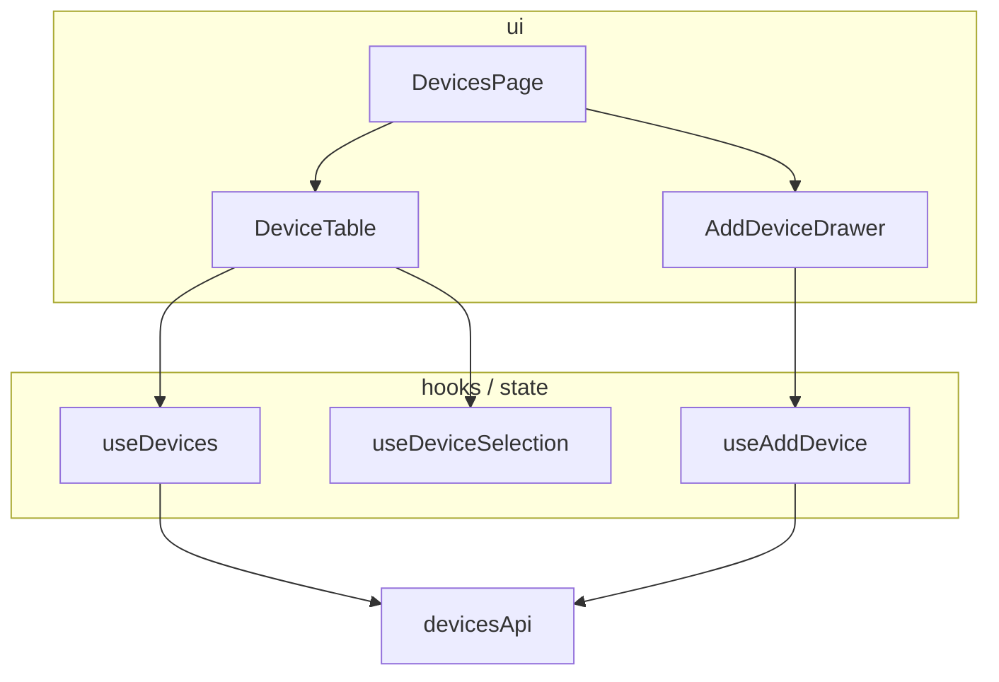

# Template — `design.md`

The feature-level record: what no single contract can hold. Per-unit decisions live **only** in
`contracts/<unit>.md` — the index links to them, never restates them. Omit empty sections; with
≤2 NEW units and no MODIFY, keep only the index, the ownership lines, and the gate verdict (the
overview diagram is optional there — the index says it all). Example rows show the expected shape.

````markdown
# <Feature> — design

## Requirement flow
<per fact: origin (server / user action / device) → what transforms it → what renders it>

## Architecture overview
<one diagram: every unit in its layer, arrows = dependency direction (must match the index)>



## Unit index
| Unit | Tag | Kind / layer | Depends on | Contract |
|------|-----|--------------|------------|----------|
| DevicesPage | NEW | component · ui | DeviceTable, useDevices | [contract](./contracts/devices-page.md) |
| useDevices | EXISTING | hook | devicesApi | — (reused as-is, read-only) |
| DeviceTable | MODIFY | component · ui | — | [contract](./contracts/device-table.md) |
<!-- Depends-on encodes build order, leaf-first: units with no unresolved deps = parallel scopes -->

## Ownership table
| Fact | Owner (tier) | Rule |
|------|--------------|------|
| device list | useDevices (server cache) | R2 |
| selected device id | useDeviceSelection (client store) | R3 |

## Interaction decisions
| Interaction | Mechanism |
|-------------|-----------|
| selection shared by table + detail | store selector |
| add succeeds → list reflects it | the write invalidates the device-list key |

## Failure containment
<error/suspense boundary placement per surface (R11)>

## Blast radius (MODIFY units)
| Unit | External importers | Decision |
|------|--------------------|----------|
| DeviceTable | AlarmsPage | contract kept backward-compatible |

## Criteria map
| AC / NFR | Owning unit |
|----------|-------------|
| AC-1.1 | DeviceTable |

## Decisions & alternatives (contested choices only)
- chose URL params over the store for filters — shareable/reload-safe outweighed store locality

## Architecture Gate
<one outcome per check C1–C8; findings name their units — formats in references/challenges.md>
### Justifications
<recorded HIGH exceptions a later re-run checks for>
````

**Completeness check (blocking, before hand-off)**
- Every MODIFY/NEW unit in the index links to an existing, non-empty contract; every contract is
  reachable from the index.
- The overview diagram and the index agree — same units, same dependency arrows.
- Every AC/NFR from the requirements appears exactly once in the criteria map.
- The Architecture Gate records an outcome for every check (C1–C8) and meets the hand-off
  criteria: no open CRITICAL; every HIGH passed or justified; every MEDIUM passed or debt-recorded.
