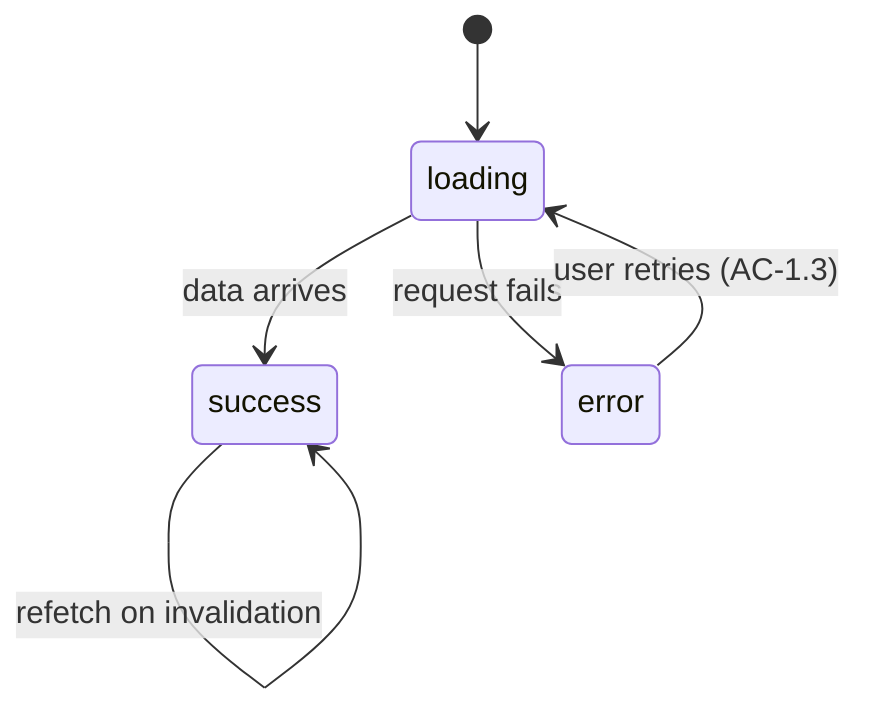

# Template — `contracts/<unit>.md`

One per MODIFY/NEW unit: its public surface, concrete enough that implementation and tests can be
written against it without re-deriving the design. Interface only — name the types, not the code.

````markdown
## <UnitName> — contract
- **Kind / layer:** component | hook | store | api | service · <feature folder>
- **Public API** (exact types — no `any`):
  - component → `interface <Unit>Props { … }`; what it renders; callbacks it fires
  - hook → `use<Unit>(args: …): { … }` — the full return type
  - store → state shape + intent-named action signatures
  - service → `create<Unit>(opts): <Unit>` + lifecycle (create/destroy) + events
- **States it must expose:** loading · empty · error · success · disabled — each mapped to an
  observable signal (rendered text, role/aria state, enabled control) the ACs assert against.
- **Traces to:** AC-<story>.<n>, … (the criteria this unit owns)
- **Testability seam:** how it runs in isolation — a component via props/providers, a hook via
  controlled inputs, a service via its interface. Never by standing up its host. (R7)
- **Depends on:** <inward-pointing units only — ui → hooks/store → api/services> (R9)
- **Must not:** <the negative space that keeps the boundary from eroding — e.g. "fetch data
  (receives it via props)", "import the store", "hold server-owned facts">
- **Behaviour** (when applicable): a diagram of the unit's state transitions, or the workflow of an
  AC/US it owns — every state shown must appear in "States it must expose"; every transition must
  be reachable through the Public API. Omit for trivially stateless units.


````
