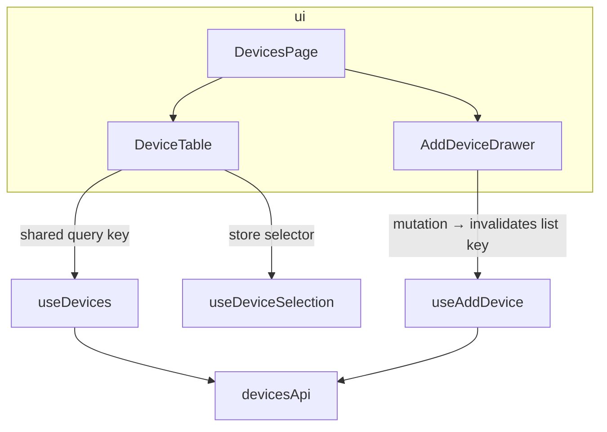

# Template — `design.md`

The feature-level record: what no single contract can hold. Per-unit decisions live **only** in
`contracts/<unit>.md` — the index links to them, never restates them. Omit empty sections; with
≤2 NEW units and no MODIFY, keep only the unit index, the ownership lines, the AC → Verification
table, and the gate verdict. Example rows show the expected shape.

````markdown
# <Feature> — design

## Architecture overview
<every unit in its layer; arrows = dependency direction; edge labels = interaction mechanism>



## Unit index
| Unit | Tag | Kind / layer | Depends on | Importers (MODIFY) | Contract |
|------|-----|--------------|------------|--------------------|----------|
| DevicesPage | NEW | component · ui | DeviceTable, useDevices | — | [contract](./contracts/devices-page.md) |
| useDevices | EXISTING | hook | devicesApi | — | — (reused as-is, read-only) |
| DeviceTable | MODIFY | component · ui | — | AlarmsPage — kept compatible | [contract](./contracts/device-table.md) |
<!-- Depends-on encodes build order, leaf-first: units with no unresolved deps = parallel scopes.
     Every MODIFY names its external importers with a decision: kept compatible | folded into scope. -->

## Ownership table
| Fact | Owner (tier) | Rule |
|------|--------------|------|
| device list | useDevices (server cache) | R2 |
| selected device id | useDeviceSelection (client store) | R3 |

## Failure containment
<error/suspense boundary placement per surface (R11)>

## AC → Verification
| AC / NFR | Description | Level | Test location |
|----------|-------------|-------|---------------|
| AC-1.1 | list renders sorted A→Z | component | `DevicesPage.test.tsx` |
| NFR-3 | no refetch on window focus | hook · real QueryClientProvider (T4) | `useDevices.test.tsx` |
| NFR-1 | no raw hex in source | CI guard (T5) | `no-hardcoded-hex.test.ts` |
<!-- level = harness tier from the owning unit's seam; test labels carry the ID verbatim (T1);
     the observable assertion target lives in the owning contract's "states it must expose". -->

## Decisions & alternatives (contested choices only)
- chose URL params over the store for filters — shareable/reload-safe outweighed store locality

## Architecture Gate
<one outcome per check C1–C8; findings name their units — formats in references/challenges.md>
### Justifications
<recorded HIGH exceptions a later re-run checks for>
````

**Completeness check (blocking, before hand-off)**
- Every MODIFY/NEW unit in the index links to an existing, non-empty contract; every contract is
  reachable from the index.
- The overview diagram and the index agree — same units, same dependency arrows.
- Every AC/NFR from the requirements has exactly one AC → Verification row (level + test
  location); every pattern-ban NFR's row is a CI-resident guard.
- The Architecture Gate records an outcome for every check (C1–C8) and meets the hand-off
  criteria: no open CRITICAL; every HIGH passed or justified; every MEDIUM passed or debt-recorded.
