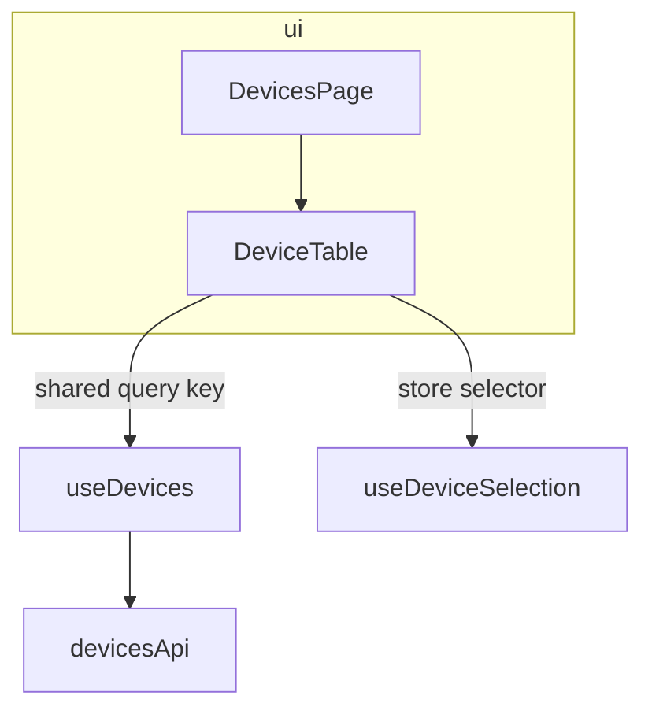
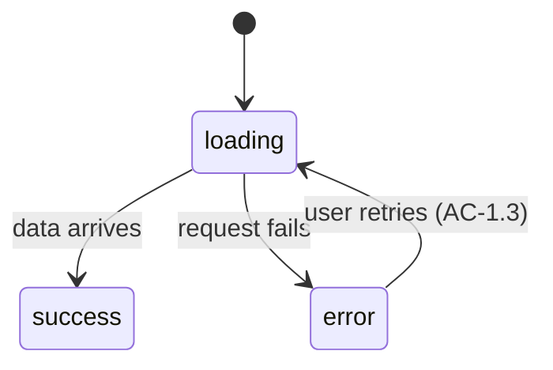

# Design (step 4) and self-check (step 5)

For every MODIFY/NEW unit in the inventory, according to the user and data flows, decide in
order — data contract, state design, decomposition — applying the rule files under
`rules/`; then consolidate into `design.md` + `contracts/`.

## Per-unit procedure

1. **Data contract** — WHAT it consumes and produces · WHERE the data comes from · WHERE it
   goes · HOW (mechanism from the picker below).
2. **State design** — per [rules/state-ownership.md](../rules/state-ownership.md):
   - WHAT facts it owns; WHERE each initial value comes from;
   - HOW changes are triggered — user interaction · timer · event from another unit ·
     external event (websocket, SSE, device/IPC) · subscription · another state's change;
   - HOW changes propagate — props · context · store · server cache · listenable event;
   - then commit to the **concrete design**: `useState`/`useReducer` · custom hook ·
     context provider · store slice · listenable service · query hook.
3. **Decompose right** — per [rules/decompose-components.md](../rules/decompose-components.md)
   and [rules/services-and-boundaries.md](../rules/services-and-boundaries.md). Splits and
   merges carry their own blast radius — pass the right-size test before cutting.
4. **Generalize deliberately** — would a more generic shape benefit the wider design
   (another flow or feature already needing it, future demand, scalability)? Adopt on
   demonstrated demand with a bounded blast radius, or on explicit user instruction — never
   speculatively.

## Mechanism picker

The loosest coupling that carries the interaction:

| Interaction | Mechanism |
|-------------|-----------|
| Server fact shared by many units | the shared query key — not prop-drilling, not a client copy |
| Parent ↔ child, local | props down, callbacks up |
| Client fact across an unrelated subtree | a store selector |
| Client fact across a subtree with a single owner | context provider |
| React ↔ imperative resource / continuous stream | a service event, bridged by one hook |
| Cross-cutting client state with shared invariants | one feature-owned store |

No central manager owning all state and interactions — God-unit coupling renamed.

## Output layout

- **`design.md`** — the feature-level view only. Per-unit decisions live in the contract
  files; design.md links, never restates.
- **`contracts/<group>.md`** — contracts grouped by relation: units collaborating on the
  same flow/feature slice (a component + its hooks + its service) share one file, so a
  downstream task reads exactly one file per work item. Each unit appears in exactly one
  group.
- Fast path → the delta template below, as a single short file.

## `design.md` template

Omit empty sections.

````markdown
# <Feature> — design

## Architecture
<every unit in its layer; arrows = dependency direction; edge labels = mechanism>


## Flows
<final ground-truth user & data flow tables — segments tagged NEW/existing, steps citing ACs>

## Ownership
| Fact | Owner | Concrete design | ACs |
|------|-------|-----------------|-----|
| device list | useDevices | query hook (server cache) | AC-1.1 |
| selected id | useDeviceSelection | store slice | AC-2.1 |

## Units
| Unit | Tag | Kind / layer | Depends on | Importers (MODIFY) | Contract |
|------|-----|--------------|------------|--------------------|----------|
| useDevices | NEW | hook | devicesApi | — | [device-list](./contracts/device-list.md) |
<REUSE units get a row, no contract; depends-on encodes build order leaf-first>

## Failure containment
<error/suspense boundary placement per surface — see rules/services-and-boundaries.md>

## Test strategy
| AC / NFR | Level | Test location |
|----------|-------|---------------|
| AC-1.1 | component | `DevicesPage.test.tsx` |
| AC-2.1 | hook | `useDeviceSelection.test.ts` |
<level = the harness tier from the owning contract's Test seam; test labels cite the AC id
verbatim so authoring downstream is mechanical>

## Open items
<unresolved self-check findings and recorded debt — each with what was tried / why deferred>
````

## `contracts/<group>.md` template

One `##` per unit; every field a sub-header, not a bullet.

````markdown
# <group> — contracts

## <UnitName> — NEW | MODIFY · component | hook | store | service · <feature>

### Public API
<exact types, no `any` — component → props + callbacks it fires; hook → full signature and
return type; store → state shape + intent-named actions; service → `create<Unit>(opts)` +
lifecycle + events>

### Data
consumes <fact> from <source> via <mechanism> · produces <fact> to <sink> via <mechanism>

### State design
<useState | custom hook | context provider | store slice | listenable service | query hook>
— owns <fact> · changes on <trigger> · propagates via <mechanism>

### States exposed
loading · empty · error · success · disabled — each mapped to an observable signal the ACs
assert against (omit states that don't apply)

### Traces to
AC-<story>.<n>, … (the criteria this unit owns)

### Test seam
<how the unit runs in isolation — component via props/providers, hook via controlled
inputs, store via its actions, service via its interface — never by standing up its host;
the ACs assert against the observable signals in States exposed>

### Depends on / Must not
<inward-pointing units only> / <the negative space — e.g. "fetch data (receives it via
props)", "import the store", "hold server-owned facts">

### Importers (MODIFY only)
<each — kept compatible | migrated in scope>

### Behaviour (stateful units only)
<every state appears in States exposed; every transition reachable through the Public API,
citing its AC>

````

## Contract delta template (fast path)

````markdown
# Delta — <unit> (`path`)

### Change
one sentence + AC/bug id

### Case
the branch/case fixed — observable outcome before → after

### Surface
what changes in the public API or state design (often "none")

### Must not change
the behaviour importers rely on

### Importers checked
all unaffected | <named migrations>
````

## Self-check (step 5 — internal self-correction only)

Adversarially re-read the draft — try to break it, don't defend it. Findings drive
re-design, not a report.

**Blocking — re-design the affected units until these pass:**

- **One owner per fact.** No dual owners, no client copies of server facts, no stored
  derivations. (rules/state-ownership.md)
- **Every AC traced to exactly one contract, with a test-strategy row.** Unowned AC =
  missing unit; dual-owned = ambiguous split. An AC resting on a fact the unit doesn't own
  is derived — the unit consumes the owner's interface instead. An AC missing from the
  Test strategy table, or whose owning contract lacks a workable Test seam, fails.
- **Every flow walks end-to-end.** Origin → transforms → sinks, a named unit at every hop,
  a named mechanism between hops. An ambiguous handoff (nobody owns the invalidation; two
  units both think they trigger the refetch) fails and names the unit to re-design.
- **Blast radius closed.** Every MODIFY/REPLACE importer has a decision (kept compatible |
  migrated in scope); every split/merge passes the right-size test
  (rules/decompose-components.md); every REPLACE names its useless-after removal or its
  architecture payoff.

**Advisory — fix if the fix is bounded, otherwise record under Open items:**

- **Reuse before create.** A NEW unit whose responsibility an existing unit already owns
  re-tags to REUSE/MODIFY — blocking if the duplicate owns a fact.
- **Loosest coupling per interaction** (mechanism picker). A store where props suffice,
  prop-drilling where a shared query key serves — downgrade it.
- **Contract minimalism.** Anything not demanded by an AC or a wired flow is invented
  scope — cut it.

**Budget: max 2 design ⇄ check loops.** Open items after that are never silently shipped:
**pause and reach the caller** — present each item with what was tried, take their decision
or steering, and resume the affected steps with that input (SKILL.md step 6).
